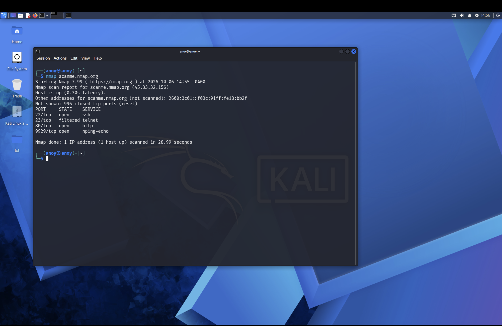
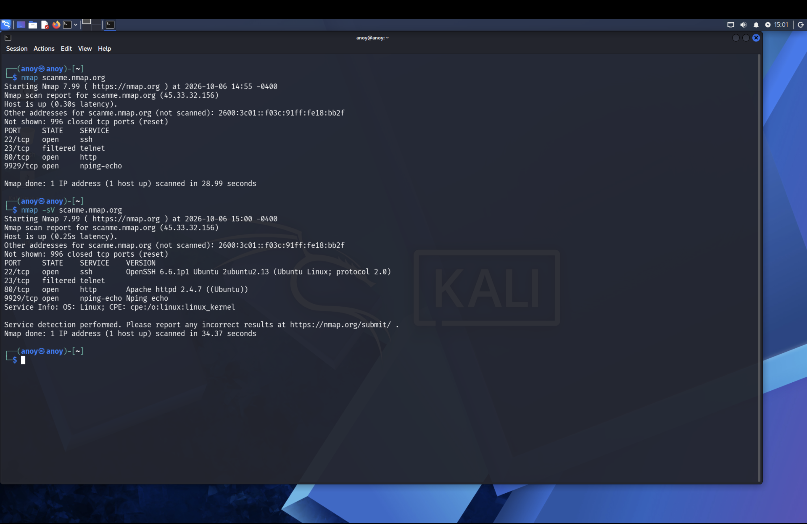
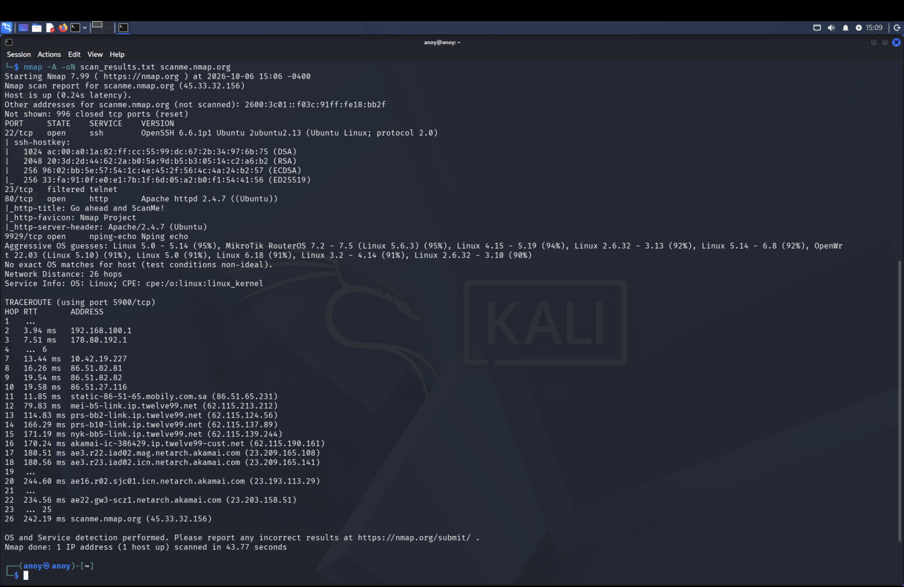

# 🛡️ Network Reconnaissance & Port Scanning Project

## 📌 Project Overview
In this practical lab, I conducted network reconnaissance and service enumeration using **Nmap** on **Kali Linux** against an authorized test target (`scanme.nmap.org`). The goal was to identify open ports, running services, software versions, and potential security risks.

---

## 🛠️ Tools Used
* **OS:** Kali Linux
* **Scanner:** Nmap 7.99
* **Target:** scanme.nmap.org (45.33.32.156)

---

## 🚀 Execution & Steps

### Step 1: Basic Host Discovery & Port Scanning
* **Command:** `nmap scanme.nmap.org`
* **Outcome:** Identified active open ports including SSH (22), HTTP (80), and nping-echo (9929), along with a filtered Telnet port (23).

---

### Step 2: Service & Software Version Enumeration
* **Command:** `nmap -sV scanme.nmap.org`
* **Outcome:** Detected specific software versions:
  * SSH: `OpenSSH 6.6.1p1` (Ubuntu)
  * HTTP: `Apache httpd 2.4.7` (Ubuntu)

---

### Step 3: Aggressive Scan & Automated Reporting
* **Command:** `nmap -A -oN scan_results.txt scanme.nmap.org`
* **Outcome:** Extracted SSH keys, web page title (`Go ahead and ScanMe!`), traced 26 network hops via Traceroute, and exported findings into a `scan_results.txt` file for documentation.

---

## 🔐 Security Recommendations & Key Takeaways
1. **Patch Management:** The identified versions (`Apache 2.4.7` and `OpenSSH 6.6.1p1`) are outdated and should be updated to the latest stable versions to prevent known CVE exploits.
2. **Web Security:** Traffic on Port 80 (HTTP) is unencrypted. It is recommended to enforce SSL/TLS encryption by migrating to HTTPS (Port 443).
3. **Filter Unnecessary Services:** Ensure filtered or unused ports like Telnet (Port 23) remain blocked by Firewall/ACLs as Telnet transmits credentials in plain text.
